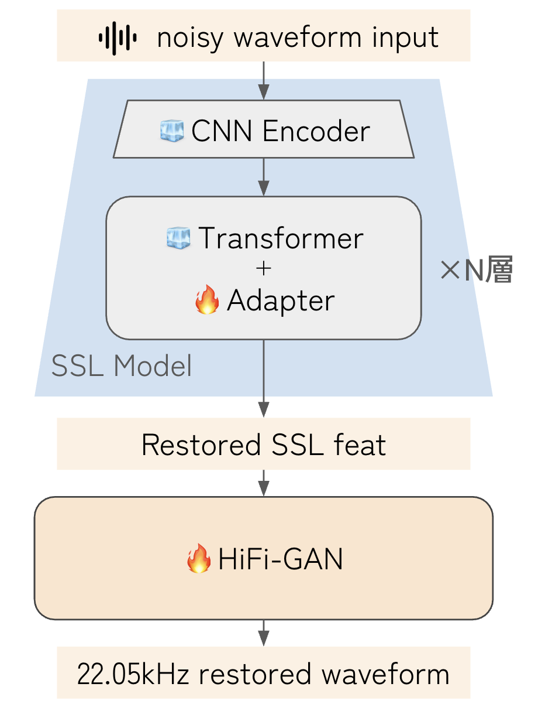

# Miipher-2

<p align="center">
  
  
  <a href="https://arxiv.org/abs/2505.04457"></a>
  <a href="https://huggingface.co/Atotti/miipher-2-HuBERT-HiFi-GAN-v0.1"></a>
</p>

<p align="center">
  <b>Unofficial implementation of Miipher-2: High-quality speech enhancement via HuBERT + Parallel Adapter</b>
</p>

<p align="center">
  <a href="#-key-features">Key Features</a> •
  <a href="#-demo">Demo</a> •
  <a href="#-quick-start">Quick Start</a> •
  <a href="#-model-zoo">Model Zoo</a> •
  <a href="#-training">Training</a> •
  <a href="#-evaluation">Evaluation</a> •
  <a href="#-citation">Citation</a>
</p>

---

## 🚀 Key Features

- **Speech enhancement** based on [Miipher-2](https://arxiv.org/abs/2505.04457) architecture
- **Lightweight Parallel Adapter** design for efficient feature adaptation
- **Pre-trained models** available on [🤗 Hugging Face](https://huggingface.co/Atotti/miipher-2-HuBERT-HiFi-GAN-v0.1)
- **Comprehensive evaluation pipeline** with multiple metrics

## 🎧 Demo

Experience the power of our model speech enhancement:

<div align="center">
<table>
  <thead>
    <tr>
      <th>🔊 Degraded Audio</th>
      <th>✨ Enhanced Audio</th>
    </tr>
  </thead>
  <tbody>
    <tr>
      <td align="center">
        
        <br>
        <em>Noisy input</em>
      </td>
      <td align="center">
        
        <br>
        <em>Clean output</em>
      </td>
    </tr>
  </tbody>
</table>
</div>

## 🛠️ Quick Start

### Prerequisites

```bash
# Install dependencies using uv
uv sync
```

### 📁 Project Structure

```
open-miipher-2/
├── configs/          # Hydra configuration files
├── src/miipher_2/    # Core Python modules
├── cmd/              # CLI entry points
├── exp/              # Model checkpoints
└── docs/             # Documentation
```

### 🚀 Quick Inference

Use our pre-trained model for instant speech enhancement:

```bash
# Download pre-trained model from Hugging Face
# Model: miipher-2-HuBERT-HiFi-GAN-v0.1

# Run inference on your audio files
uv run cmd/inference_dir.py --config-name infer_dir
```

## 🤗 Model Zoo

| Model | SSL Backbone | Adapter Layers | Vocoder | Download |
|-------|--------------|----------------|---------|----------|
| miipher-2 HuBERT HiFi-GAN v0.1 | mHuBERT-147 | Layer 6 | HiFi-GAN | [🤗 HuggingFace](https://huggingface.co/Atotti/miipher-2-HuBERT-HiFi-GAN-v0.1) |

## 📚 Training

### Step 1: Data Preprocessing

Generate pseudo-degraded dataset from clean speech:

```bash
# Process JVS corpus (Japanese)
uv run cmd/preprocess.py --config-name preprocess_jvs

# Process LibriTTS (English)
uv run cmd/preprocess.py --config-name preprocess_libritts_r

# Process FLEURS (Multilingual)
uv run cmd/preprocess.py --config-name preprocess_fleurs_r
```

Output is saved in WebDataset format for efficient data loading.

### Step 2: Train Parallel Adapter

```bash
# Train adapter module
uv run cmd/train_adapter.py --config-name adapter_layer_6_mhubert_147

# Resume from checkpoint
uv run cmd/train_adapter.py \
    checkpoint.resume_from="exp/adapter_layer_6_mhubert_147/checkpoint_199k.pt" \
    --config-name adapter_layer_6_mhubert_147
```

### Step 3: Train SSL-Vocoder

```bash
# Pre-train Lightning SSL-Vocoder
uv run cmd/pre_train_vocoder.py --config-name hifigan_pretrain_layer_6_mhubert_147
```

> 💡 **Note**: Configuration is automatically inherited from checkpoint unless explicitly overridden.


## 📊 Evaluation

### Step 1: Generate Degraded Test Data

Create evaluation dataset with various noise conditions:

```bash
uv run cmd/degrade.py \
    --clean_dir <path_to_clean_audio> \
    --noise_dir <path_to_noise_samples> \
    --out_dir <output_directory>
```

### Step 2: Run Enhancement

Process degraded audio through the model:

```bash
uv run cmd/inference_dir.py --config-name infer_dir
```

### Step 3: Compute Metrics

Evaluate enhancement quality with multiple metrics:

```bash
uv run cmd/evaluate.py \
    --clean_dir <clean_audio_dir> \
    --degraded_dir <degraded_audio_dir> \
    --restored_dir <enhanced_audio_dir> \
    --outfile results.csv
```

Metrics include:
- **PESQ** (Perceptual Evaluation of Speech Quality)
- **STOI** (Short-Time Objective Intelligibility)
- **SI-SDR** (Scale-Invariant Signal-to-Distortion Ratio)
- **MOS-LQO** (Mean Opinion Score)

## 🏗️ Architecture



### Key Components

1. **HuBERT Feature Extractor**: Multilingual HuBERT (mHuBERT-147) for robust speech representations
2. **Parallel Adapter**: Lightweight feed-forward network inserted at specific layers
3. **Feature Cleaner**: Denoising module operating on SSL features
4. **Lightning SSL-Vocoder**: HiFi-GAN-based vocoder

## 🔧 Configuration

All configurations are managed through Hydra. Key config files:

- `configs/adapter_layer_6_mhubert_147.yaml` - Adapter training
- `configs/infer_dir.yaml` - Inference settings
- `configs/preprocess_*.yaml` - Data preprocessing
